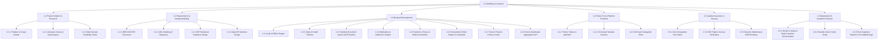

# WellNexa AI — Work Breakdown Structure (WBS)

```mermaid
graph TD
    Root["1.0 WellNexa AI System"]
    
    Root --> W1["1.1 Project Initiation & Research"]
    W1 --> W11["1.1.1 Problem & Scope Charter"]
    W1 --> W12["1.1.2 Literature Survey & Gap Analysis"]
    W1 --> W13["1.1.3 Multi-Domain Feasibility Study"]
    
    Root --> W2["1.2 Requirements & Design Modeling"]
    W2 --> W21["1.2.1 IEEE-830 SRS Document"]
    W2 --> W22["1.2.2 UML Modeling (7 Diagrams)"]
    W2 --> W23["1.2.3 3NF Relational Database Design"]
    W2 --> W24["1.2.4 OpenAPI Interface Design"]
    
    Root --> W3["1.3 Backend Development"]
    W3 --> W31["1.3.1 Auth & RBAC Engine"]
    W3 --> W32["1.3.2 Vitals & Health Timeline"]
    W3 --> W33["1.3.3 Medical Document Vault & OCR Pipeline"]
    W3 --> W34["1.3.4 Medication & Adherence Engine"]
    W3 --> W35["1.3.5 Nutrition, Fitness & Wellness Modules"]
    W3 --> W36["1.3.6 Grounded AI RAG Engine & Guardrails"]
    W3 --> W37["1.3.7 Doctor Portal & Privacy Center"]
    W3 --> W38["1.3.8 Home Dashboard Aggregation API"]
    
    Root --> W4["1.4 Flutter Cross-Platform Frontend"]
    W4 --> W41["1.4.1 Theme Tokens & ApiClient"]
    W4 --> W42["1.4.2 13-Domain Modular Screens"]
    W4 --> W43["1.4.3 GoRouter Navigation Shell"]
    
    Root --> W5["1.5 Quality Assurance & Security"]
    W5 --> W51["1.5.1 Unit & Integration Test Suites"]
    W5 --> W52["1.5.2 E2E Patient Journey Verification"]
    W53["1.5.3 Security Hardening & IDOR Auditing"]
    W5 --> W53
    
    Root --> W6["1.6 Deployment & Academic Defense"]
    W6 --> W61["1.6.1 Docker Compose Multi-Container Orchestration"]
    W6 --> W62["1.6.2 Realistic Demo Seed Script"]
    W6 --> W63["1.6.3 Final Capstone Report & Viva Walkthrough"]
```
