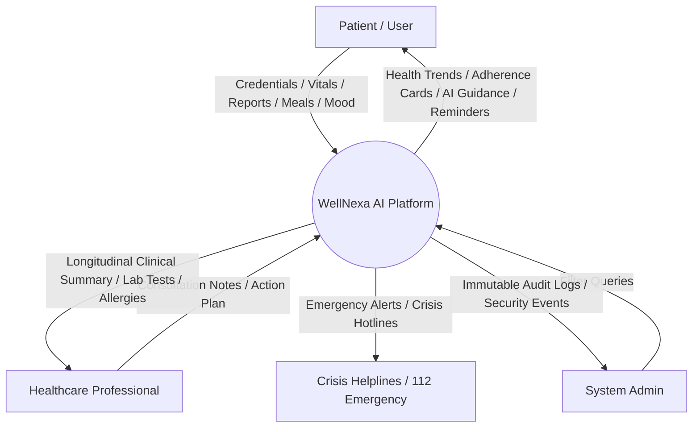
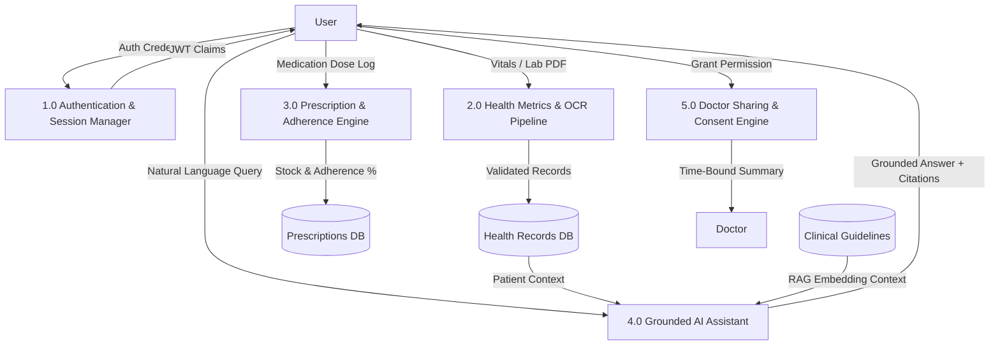

# WellNexa AI — System Context & Data Flow Diagrams

## Level-0 Context Data Flow Diagram (DFD)

```mermaid
graph TD
    P[Patient / User] -->|Credentials / Vitals / Reports / Meals / Mood| WN((WellNexa AI Platform))
    WN -->|Health Trends / Adherence Cards / AI Guidance / Reminders| P
    
    D[Healthcare Professional] -->|Consultation Notes / Action Plan| WN
    WN -->|Longitudinal Clinical Summary / Lab Tests / Allergies| D
    
    WN -->|Emergency Alerts / Crisis Hotlines| E[Crisis Helplines / 112 Emergency]
    A[System Admin] -->|Filter Queries| WN
    WN -->|Immutable Audit Logs / Security Events| A
```

## Level-1 Decomposed DFD

```mermaid
graph TD
    User -->|Auth Credentials| P1[1.0 Authentication & Session Manager]
    P1 -->|JWT Claims| User
    
    User -->|Vitals / Lab PDF| P2[2.0 Health Metrics & OCR Pipeline]
    P2 -->|Validated Records| DS1[(Health Records DB)]
    
    User -->|Medication Dose Log| P3[3.0 Prescription & Adherence Engine]
    P3 -->|Stock & Adherence %| DS2[(Prescriptions DB)]
    
    User -->|Natural Language Query| P4[4.0 Grounded AI Assistant]
    DS1 -->|Patient Context| P4
    DS3[(Clinical Guidelines)] -->|RAG Embedding Context| P4
    P4 -->|Grounded Answer + Citations| User
    
    User -->|Grant Permission| P5[5.0 Doctor Sharing & Consent Engine]
    P5 -->|Time-Bound Summary| Doctor
```
