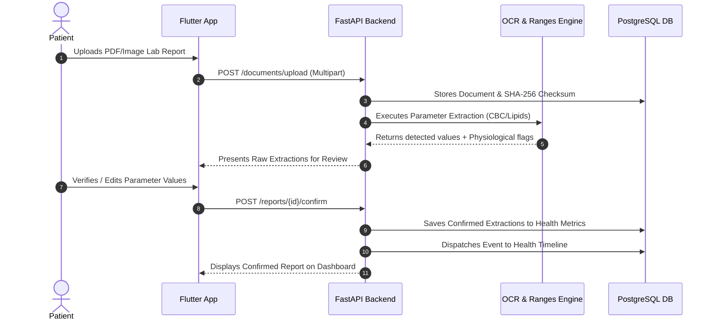
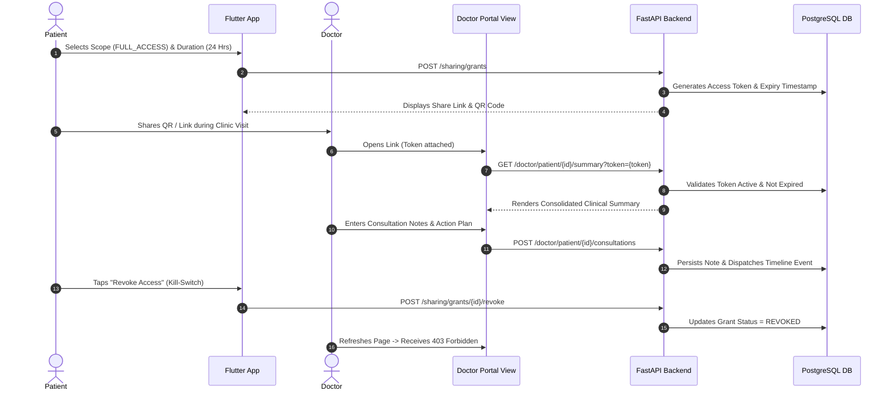

# WellNexa AI — User Journey Maps

## 1. Patient Diagnostic Journey (From Physical Report to Timeline)

```mermaid
sequenceDiagram
    autonumber
    actor Patient
    participant Flutter as Flutter App
    participant API as FastAPI Backend
    participant OCR as OCR & Ranges Engine
    participant DB as PostgreSQL DB
    
    Patient->>Flutter: Uploads PDF/Image Lab Report
    Flutter->>API: POST /documents/upload (Multipart)
    API->>DB: Stores Document & SHA-256 Checksum
    API->>OCR: Executes Parameter Extraction (CBC/Lipids)
    OCR-->>API: Returns detected values + Physiological flags
    API-->>Flutter: Presents Raw Extractions for Review
    Patient->>Flutter: Verifies / Edits Parameter Values
    Flutter->>API: POST /reports/{id}/confirm
    API->>DB: Saves Confirmed Extractions to Health Metrics
    API->>DB: Dispatches Event to Health Timeline
    API-->>Flutter: Displays Confirmed Report on Dashboard
```

## 2. Doctor Consultation & Time-Bound Sharing Journey

```mermaid
sequenceDiagram
    autonumber
    actor Patient
    participant Flutter as Flutter App
    actor Doctor
    participant Portal as Doctor Portal View
    participant API as FastAPI Backend
    participant DB as PostgreSQL DB
    
    Patient->>Flutter: Selects Scope (FULL_ACCESS) & Duration (24 Hrs)
    Flutter->>API: POST /sharing/grants
    API->>DB: Generates Access Token & Expiry Timestamp
    API-->>Flutter: Displays Share Link & QR Code
    Patient->>Doctor: Shares QR / Link during Clinic Visit
    Doctor->>Portal: Opens Link (Token attached)
    Portal->>API: GET /doctor/patient/{id}/summary?token={token}
    API->>DB: Validates Token Active & Not Expired
    API-->>Portal: Renders Consolidated Clinical Summary
    Doctor->>Portal: Enters Consultation Notes & Action Plan
    Portal->>API: POST /doctor/patient/{id}/consultations
    API->>DB: Persists Note & Dispatches Timeline Event
    Patient->>Flutter: Taps "Revoke Access" (Kill-Switch)
    Flutter->>API: POST /sharing/grants/{id}/revoke
    API->>DB: Updates Grant Status = REVOKED
    Doctor->>Portal: Refreshes Page -> Receives 403 Forbidden
```
