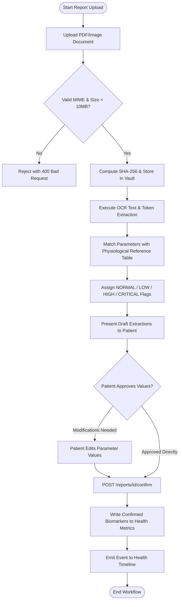
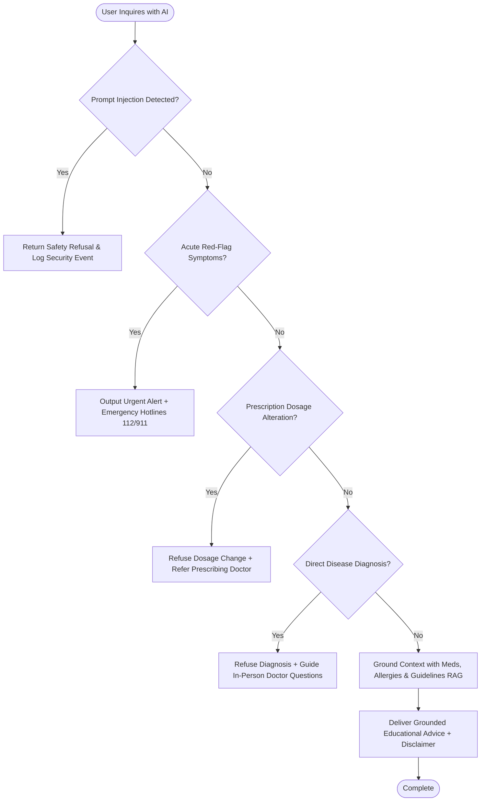

# WellNexa AI — Core Activity Diagrams

## 1. Medical Document OCR & Human Confirmation Flow

```mermaid
graph TD
    Start([Start Report Upload]) --> Upload[Upload PDF/Image Document]
    Upload --> Validate{Valid MIME & Size < 10MB?}
    Validate -->|No| Reject[Reject with 400 Bad Request]
    Validate -->|Yes| Store[Compute SHA-256 & Store in Vault]
    Store --> OCR[Execute OCR Text & Token Extraction]
    OCR --> Match[Match Parameters with Physiological Reference Table]
    Match --> Flag[Assign NORMAL / LOW / HIGH / CRITICAL Flags]
    Flag --> Present[Present Draft Extractions to Patient]
    Present --> Verify{Patient Approves Values?}
    Verify -->|Modifications Needed| Edit[Patient Edits Parameter Values]
    Edit --> Confirm[POST /reports/id/confirm]
    Verify -->|Approved Directly| Confirm
    Confirm --> Persist[Write Confirmed Biomarkers to Health Metrics]
    Persist --> Timeline[Emit Event to Health Timeline]
    Timeline --> End([End Workflow])
```

## 2. AI Assistant Clinical Safety Pipeline Flow

```mermaid
graph TD
    Start([User Inquires with AI]) --> Injection{Prompt Injection Detected?}
    Injection -->|Yes| BlockInjection[Return Safety Refusal & Log Security Event]
    Injection -->|No| Emergency{Acute Red-Flag Symptoms?}
    Emergency -->|Yes| EmgRedirect[Output Urgent Alert + Emergency Hotlines 112/911]
    Emergency -->|No| RxRefuse{Prescription Dosage Alteration?}
    RxRefuse -->|Yes| BlockRx[Refuse Dosage Change + Refer Prescribing Doctor]
    RxRefuse -->|No| DiagRefuse{Direct Disease Diagnosis?}
    DiagRefuse -->|Yes| BlockDiag[Refuse Diagnosis + Guide In-Person Doctor Questions]
    DiagRefuse -->|No| Ground[Ground Context with Meds, Allergies & Guidelines RAG]
    Ground --> Output[Deliver Grounded Educational Advice + Disclaimer]
    Output --> End([Complete])
```
