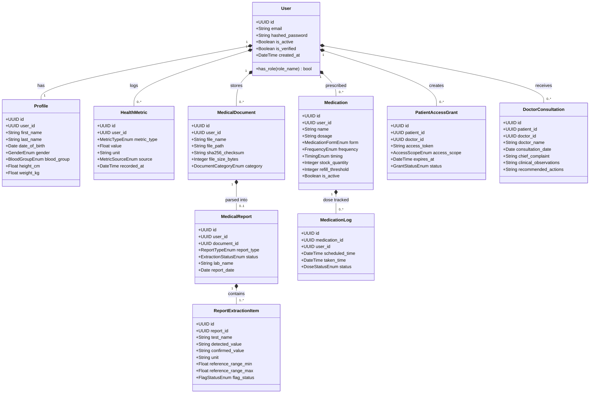

# WellNexa AI — Complete Domain Class Diagram

```mermaid
classDiagram
    class User {
        +UUID id
        +String email
        +String hashed_password
        +Boolean is_active
        +Boolean is_verified
        +DateTime created_at
        +has_role(role_name) bool
    }

    class Profile {
        +UUID id
        +UUID user_id
        +String first_name
        +String last_name
        +Date date_of_birth
        +GenderEnum gender
        +BloodGroupEnum blood_group
        +Float height_cm
        +Float weight_kg
    }

    class HealthMetric {
        +UUID id
        +UUID user_id
        +MetricTypeEnum metric_type
        +Float value
        +String unit
        +MetricSourceEnum source
        +DateTime recorded_at
    }

    class MedicalDocument {
        +UUID id
        +UUID user_id
        +String file_name
        +String file_path
        +String sha256_checksum
        +Integer file_size_bytes
        +DocumentCategoryEnum category
    }

    class MedicalReport {
        +UUID id
        +UUID user_id
        +UUID document_id
        +ReportTypeEnum report_type
        +ExtractionStatusEnum status
        +String lab_name
        +Date report_date
    }

    class ReportExtractionItem {
        +UUID id
        +UUID report_id
        +String test_name
        +String detected_value
        +String confirmed_value
        +String unit
        +Float reference_range_min
        +Float reference_range_max
        +FlagStatusEnum flag_status
    }

    class Medication {
        +UUID id
        +UUID user_id
        +String name
        +String dosage
        +MedicationFormEnum form
        +FrequencyEnum frequency
        +TimingEnum timing
        +Integer stock_quantity
        +Integer refill_threshold
        +Boolean is_active
    }

    class MedicationLog {
        +UUID id
        +UUID medication_id
        +UUID user_id
        +DateTime scheduled_time
        +DateTime taken_time
        +DoseStatusEnum status
    }

    class PatientAccessGrant {
        +UUID id
        +UUID patient_id
        +UUID doctor_id
        +String access_token
        +AccessScopeEnum access_scope
        +DateTime expires_at
        +GrantStatusEnum status
    }

    class DoctorConsultation {
        +UUID id
        +UUID patient_id
        +UUID doctor_id
        +String doctor_name
        +Date consultation_date
        +String chief_complaint
        +String clinical_observations
        +String recommended_actions
    }

    User "1" *-- "1" Profile : has
    User "1" *-- "0..*" HealthMetric : logs
    User "1" *-- "0..*" MedicalDocument : stores
    MedicalDocument "1" *-- "0..1" MedicalReport : parsed into
    MedicalReport "1" *-- "1..*" ReportExtractionItem : contains
    User "1" *-- "0..*" Medication : prescribed
    Medication "1" *-- "0..*" MedicationLog : dose tracked
    User "1" *-- "0..*" PatientAccessGrant : creates
    User "1" *-- "0..*" DoctorConsultation : receives
```
