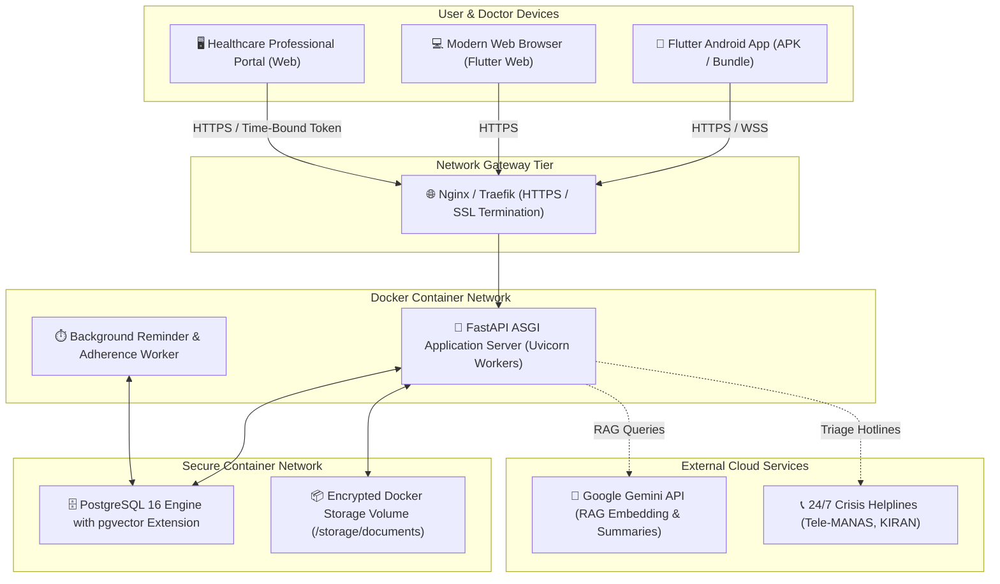

# WellNexa AI — Production Deployment Diagram

```mermaid
graph TD
    subgraph Client Tier [User & Doctor Devices]
        Mobile["📱 Flutter Android App (APK / Bundle)"]
        Browser["💻 Modern Web Browser (Flutter Web)"]
        DoctorDesk["🖥️ Healthcare Professional Portal (Web)"]
    end

    subgraph Network Gateway Tier
        ReverseProxy["🌐 Nginx / Traefik (HTTPS / SSL Termination)"]
    end

    subgraph Application Server Tier [Docker Container Network]
        FastAPIServer["🚀 FastAPI ASGI Application Server (Uvicorn Workers)"]
        BackgroundWorker["⏱️ Background Reminder & Adherence Worker"]
    end

    subgraph Database Tier [Secure Container Network]
        PostgresContainer["🗄️ PostgreSQL 16 Engine with pgvector Extension"]
        StorageVolume["📦 Encrypted Docker Storage Volume (/storage/documents)"]
    end

    subgraph External Cloud Services
        GeminiAPI["🤖 Google Gemini API (RAG Embedding & Summaries)"]
        CrisisHotlines["📞 24/7 Crisis Helplines (Tele-MANAS, KIRAN)"]
    end

    Mobile -->|HTTPS / WSS| ReverseProxy
    Browser -->|HTTPS| ReverseProxy
    DoctorDesk -->|HTTPS / Time-Bound Token| ReverseProxy
    
    ReverseProxy --> FastAPIServer
    FastAPIServer <--> PostgresContainer
    FastAPIServer <--> StorageVolume
    BackgroundWorker <--> PostgresContainer
    
    FastAPIServer -.->|RAG Queries| GeminiAPI
    FastAPIServer -.->|Triage Hotlines| CrisisHotlines
```
