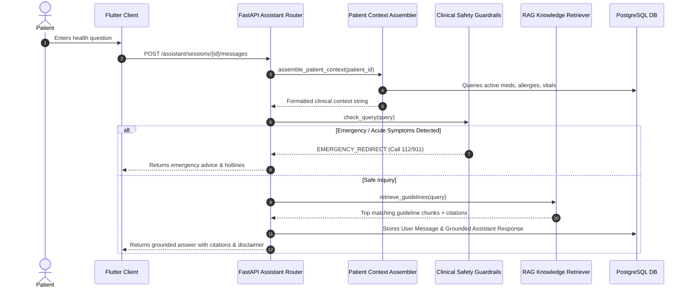
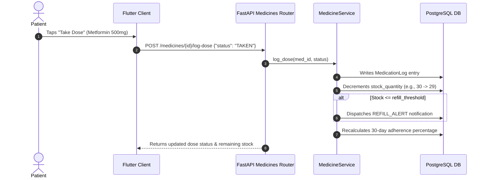

# WellNexa AI — Core Sequence Diagrams

## 1. AI Health Assistant Multi-Turn Inquiry Flow

```mermaid
sequenceDiagram
    autonumber
    actor Patient
    participant Client as Flutter Client
    participant API as FastAPI Assistant Router
    participant Assembler as Patient Context Assembler
    participant Guardrails as Clinical Safety Guardrails
    participant RAG as RAG Knowledge Retriever
    participant DB as PostgreSQL DB

    Patient->>Client: Enters health question
    Client->>API: POST /assistant/sessions/{id}/messages
    API->>Assembler: assemble_patient_context(patient_id)
    Assembler->>DB: Queries active meds, allergies, vitals
    Assembler-->>API: Formatted clinical context string
    API->>Guardrails: check_query(query)
    alt Emergency / Acute Symptoms Detected
        Guardrails-->>API: EMERGENCY_REDIRECT (Call 112/911)
        API-->>Client: Returns emergency advice & hotlines
    else Safe Inquiry
        API->>RAG: retrieve_guidelines(query)
        RAG-->>API: Top matching guideline chunks + citations
        API->>DB: Stores User Message & Grounded Assistant Response
        API-->>Client: Returns grounded answer with citations & disclaimer
    end
```

## 2. Medicine Dose Logging & Stock Decrement Flow

```mermaid
sequenceDiagram
    autonumber
    actor Patient
    participant Client as Flutter Client
    participant API as FastAPI Medicines Router
    participant Svc as MedicineService
    participant DB as PostgreSQL DB

    Patient->>Client: Taps "Take Dose" (Metformin 500mg)
    Client->>API: POST /medicines/{id}/log-dose {"status": "TAKEN"}
    API->>Svc: log_dose(med_id, status)
    Svc->>DB: Writes MedicationLog entry
    Svc->>DB: Decrements stock_quantity (e.g., 30 -> 29)
    alt Stock <= refill_threshold
        Svc->>DB: Dispatches REFILL_ALERT notification
    end
    Svc->>DB: Recalculates 30-day adherence percentage
    API-->>Client: Returns updated dose status & remaining stock
```
