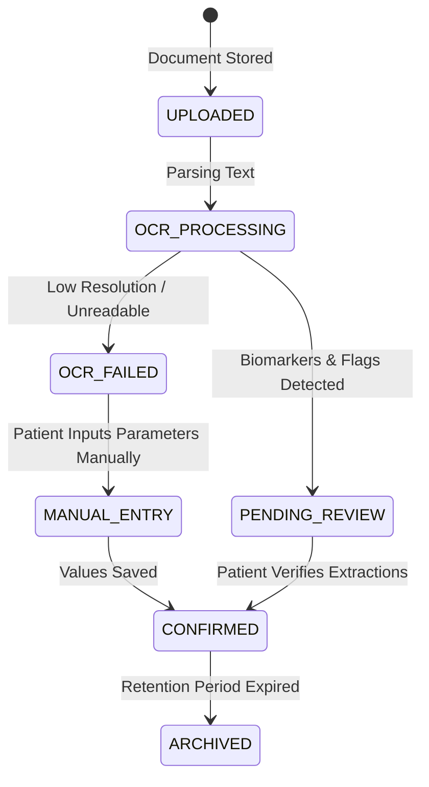
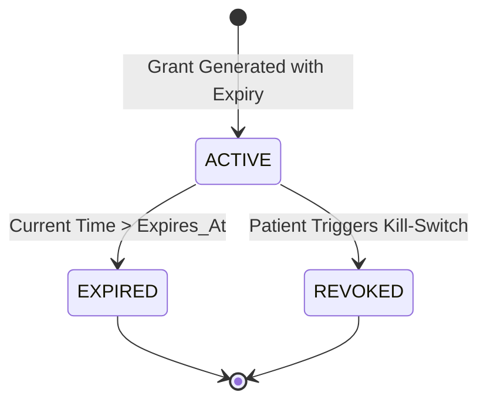
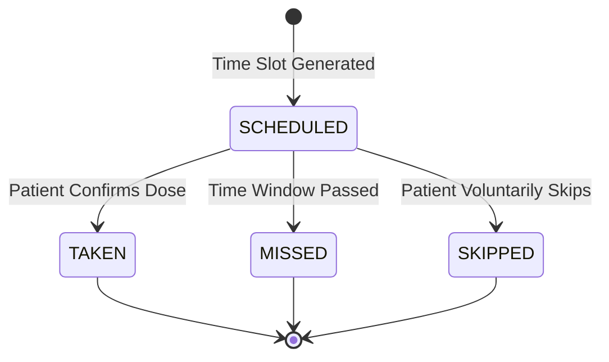

# WellNexa AI — State Machine Diagrams

## 1. Medical Document & Lab Report Processing State

```mermaid
stateDiagram-v2
    [*] --> UPLOADED : Document Stored
    UPLOADED --> OCR_PROCESSING : Parsing Text
    OCR_PROCESSING --> PENDING_REVIEW : Biomarkers & Flags Detected
    OCR_PROCESSING --> OCR_FAILED : Low Resolution / Unreadable
    OCR_FAILED --> MANUAL_ENTRY : Patient Inputs Parameters Manually
    MANUAL_ENTRY --> CONFIRMED : Values Saved
    PENDING_REVIEW --> CONFIRMED : Patient Verifies Extractions
    CONFIRMED --> ARCHIVED : Retention Period Expired
```

## 2. Doctor Access Pass Lifecycle State

```mermaid
stateDiagram-v2
    [*] --> ACTIVE : Grant Generated with Expiry
    ACTIVE --> EXPIRED : Current Time > Expires_At
    ACTIVE --> REVOKED : Patient Triggers Kill-Switch
    EXPIRED --> [*]
    REVOKED --> [*]
```

## 3. Scheduled Medication Dose State

```mermaid
stateDiagram-v2
    [*] --> SCHEDULED : Time Slot Generated
    SCHEDULED --> TAKEN : Patient Confirms Dose
    SCHEDULED --> MISSED : Time Window Passed
    SCHEDULED --> SKIPPED : Patient Voluntarily Skips
    TAKEN --> [*]
    MISSED --> [*]
    SKIPPED --> [*]
```
