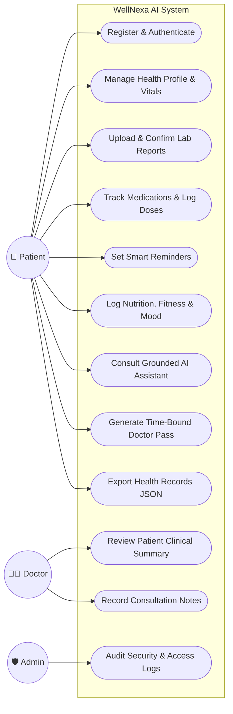
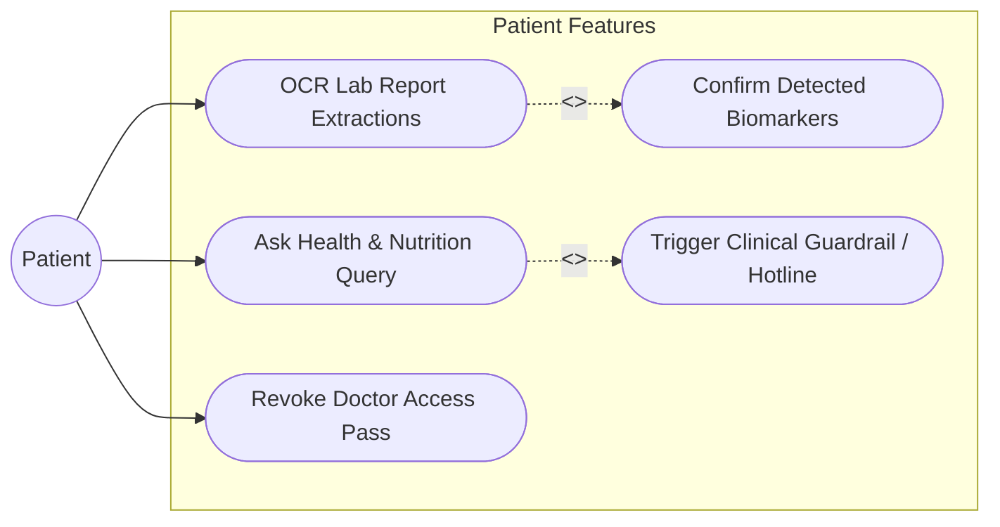

# WellNexa AI — Use Case Diagrams

## 1. Overall System Use Case Model

```mermaid
graph LR
    subgraph WellNexa AI System
        UC1([Register & Authenticate])
        UC2([Manage Health Profile & Vitals])
        UC3([Upload & Confirm Lab Reports])
        UC4([Track Medications & Log Doses])
        UC5([Set Smart Reminders])
        UC6([Log Nutrition, Fitness & Mood])
        UC7([Consult Grounded AI Assistant])
        UC8([Generate Time-Bound Doctor Pass])
        UC9([Review Patient Clinical Summary])
        UC10([Record Consultation Notes])
        UC11([Export Health Records JSON])
        UC12([Audit Security & Access Logs])
    end
    
    Patient((👤 Patient))
    Doctor((👨‍⚕️ Doctor))
    Admin((🛡️ Admin))
    
    Patient --> UC1
    Patient --> UC2
    Patient --> UC3
    Patient --> UC4
    Patient --> UC5
    Patient --> UC6
    Patient --> UC7
    Patient --> UC8
    Patient --> UC11
    
    Doctor --> UC9
    Doctor --> UC10
    
    Admin --> UC12
```

## 2. Patient Domain Use Case Detail

```mermaid
graph LR
    subgraph Patient Features
        UC_OCR([OCR Lab Report Extractions])
        UC_CONF([Confirm Detected Biomarkers])
        UC_AI([Ask Health & Nutrition Query])
        UC_SAFE([Trigger Clinical Guardrail / Hotline])
        UC_REVOKE([Revoke Doctor Access Pass])
    end
    
    P((Patient)) --> UC_OCR
    UC_OCR -.->|<<include>>| UC_CONF
    P --> UC_AI
    UC_AI -.->|<<extend>>| UC_SAFE
    P --> UC_REVOKE
```
