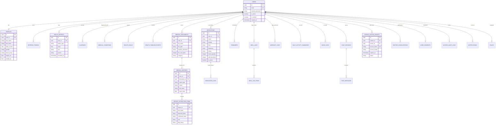

# WellNexa AI — Entity-Relationship (ER) Diagram

```mermaid
erDiagram
    USERS ||--o| PROFILES : "has"
    USERS ||--o{ REFRESH_TOKENS : "owns"
    USERS ||--o{ HEALTH_METRICS : "logs"
    USERS ||--o{ ALLERGIES : "records"
    USERS ||--o{ MEDICAL_CONDITIONS : "diagnosed_with"
    USERS ||--o{ HEALTH_GOALS : "targets"
    USERS ||--o{ HEALTH_TIMELINE_EVENTS : "contains"
    USERS ||--o{ MEDICAL_DOCUMENTS : "stores"
    MEDICAL_DOCUMENTS ||--o| MEDICAL_REPORTS : "parsed_into"
    MEDICAL_REPORTS ||--o{ REPORT_EXTRACTION_ITEMS : "contains"
    USERS ||--o{ MEDICATIONS : "prescribed"
    MEDICATIONS ||--o{ MEDICATION_LOGS : "tracks_doses"
    USERS ||--o{ REMINDERS : "schedules"
    USERS ||--o{ MEAL_LOGS : "logs_meals"
    MEAL_LOGS ||--o{ MEAL_LOG_ITEMS : "contains"
    USERS ||--o{ WORKOUT_LOGS : "logs_workouts"
    USERS ||--o{ DAILY_ACTIVITY_SUMMARIES : "records"
    USERS ||--o{ MOOD_LOGS : "journals"
    USERS ||--o{ CHAT_SESSIONS : "opens"
    CHAT_SESSIONS ||--o{ CHAT_MESSAGES : "contains"
    USERS ||--o{ PATIENT_ACCESS_GRANTS : "generates"
    USERS ||--o{ DOCTOR_CONSULTATIONS : "participates"
    USERS ||--o| USER_CONSENTS : "maintains"
    USERS ||--o{ ACCESS_AUDIT_LOGS : "tracks"
    USERS ||--o{ NOTIFICATIONS : "receives"
    USERS }|--|{ ROLES : "assigned"

    USERS {
        uuid id PK
        string email UK
        string hashed_password
        boolean is_active
        boolean is_verified
        timestamp created_at
    }

    PROFILES {
        uuid id PK
        uuid user_id FK
        string first_name
        string last_name
        date date_of_birth
        string gender
        string blood_group
        float height_cm
        float weight_kg
    }

    HEALTH_METRICS {
        uuid id PK
        uuid user_id FK
        string metric_type
        float value
        string unit
        string source
        timestamp recorded_at
    }

    MEDICAL_DOCUMENTS {
        uuid id PK
        uuid user_id FK
        string file_name
        string file_path
        string sha256_checksum
        integer file_size_bytes
        string category
    }

    MEDICAL_REPORTS {
        uuid id PK
        uuid user_id FK
        uuid document_id FK
        string report_type
        string status
        string lab_name
        date report_date
    }

    REPORT_EXTRACTION_ITEMS {
        uuid id PK
        uuid report_id FK
        string test_name
        string detected_value
        string confirmed_value
        string unit
        string flag_status
    }

    MEDICATIONS {
        uuid id PK
        uuid user_id FK
        string name
        string dosage
        string form
        string frequency
        string timing
        integer stock_quantity
        integer refill_threshold
        boolean is_active
    }

    PATIENT_ACCESS_GRANTS {
        uuid id PK
        uuid patient_id FK
        uuid doctor_id FK
        string access_token UK
        string access_scope
        timestamp expires_at
        string status
    }
```
