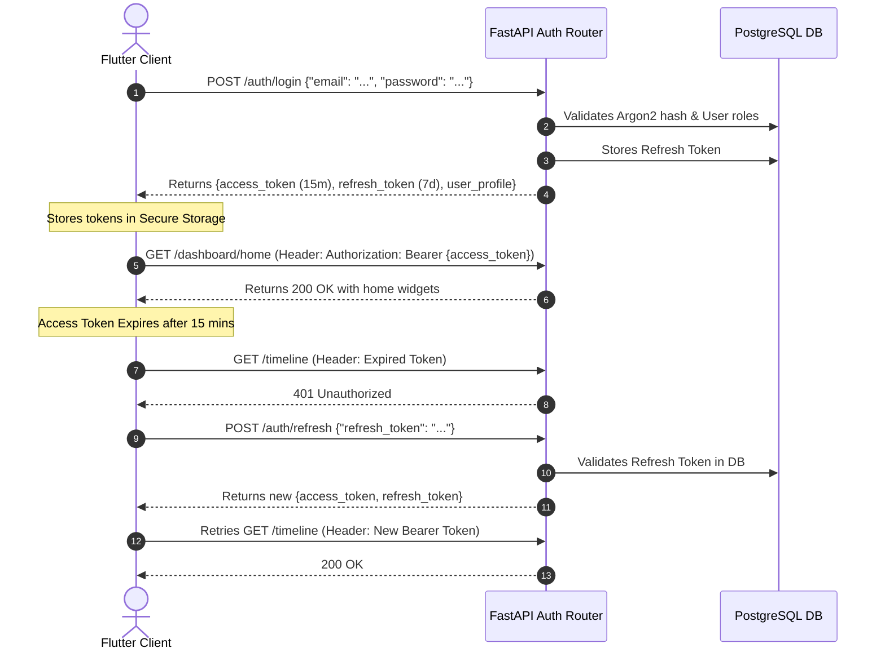

# WellNexa AI — JWT Authentication & Session Flow

```mermaid
sequenceDiagram
    autonumber
    actor Client as Flutter Client
    participant API as FastAPI Auth Router
    participant DB as PostgreSQL DB

    Client->>API: POST /auth/login {"email": "...", "password": "..."}
    API->>DB: Validates Argon2 hash & User roles
    API->>DB: Stores Refresh Token
    API-->>Client: Returns {access_token (15m), refresh_token (7d), user_profile}
    Note over Client: Stores tokens in Secure Storage

    Client->>API: GET /dashboard/home (Header: Authorization: Bearer {access_token})
    API-->>Client: Returns 200 OK with home widgets

    Note over Client: Access Token Expires after 15 mins
    Client->>API: GET /timeline (Header: Expired Token)
    API-->>Client: 401 Unauthorized

    Client->>API: POST /auth/refresh {"refresh_token": "..."}
    API->>DB: Validates Refresh Token in DB
    API-->>Client: Returns new {access_token, refresh_token}
    Client->>API: Retries GET /timeline (Header: New Bearer Token)
    API-->>Client: 200 OK
```
