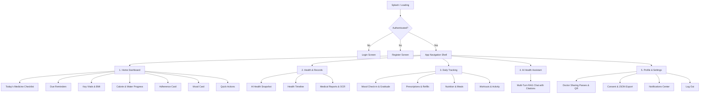

# WellNexa AI — Information Architecture & Navigation

```mermaid
graph TD
    Splash[Splash / Loading] --> Auth{Authenticated?}
    Auth -->|No| Login[Login Screen]
    Auth -->|No| Register[Register Screen]
    Auth -->|Yes| Shell[App Navigation Shell]
    
    Shell --> Tab1[1. Home Dashboard]
    Tab1 --> W_Med[Today's Medicine Checklist]
    Tab1 --> W_Rem[Due Reminders]
    Tab1 --> W_Vit[Key Vitals & BMI]
    Tab1 --> W_Nut[Calorie & Water Progress]
    Tab1 --> W_Adh[Adherence Card]
    Tab1 --> W_Mood[Mood Card]
    Tab1 --> W_Quick[Quick Actions]
    
    Shell --> Tab2[2. Health & Records]
    Tab2 --> SubT1[AI Health Snapshot]
    Tab2 --> SubT2[Health Timeline]
    Tab2 --> SubT3[Medical Reports & OCR]
    
    Shell --> Tab3[3. Daily Tracking]
    Tab3 --> T_Mood[Mood Check-in & Gratitude]
    Tab3 --> T_Med[Prescriptions & Refills]
    Tab3 --> T_Nut[Nutrition & Meals]
    Tab3 --> T_Fit[Workouts & Activity]
    
    Shell --> Tab4[4. AI Health Assistant]
    Tab4 --> Chat[Multi-Turn RAG Chat with Citations]
    
    Shell --> Tab5[5. Profile & Settings]
    Tab5 --> P_Doc[Doctor Sharing Passes & QR]
    Tab5 --> P_Priv[Consent & JSON Export]
    Tab5 --> P_Notif[Notifications Center]
    Tab5 --> P_Log[Log Out]
```
